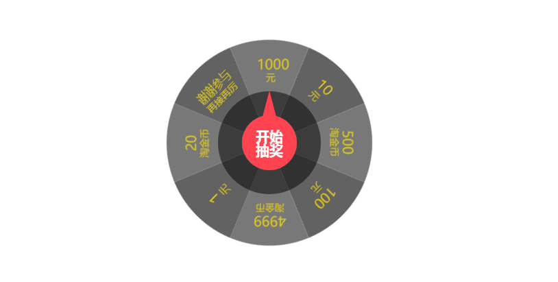
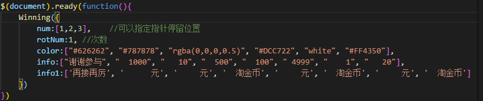

## Winning
+ 通过canvas实现，依据jq，可以单独使用winning.js。仅供参考
### 参数说明
- num  (array) 指针 停留位置
- rotNum (Number) 次数 转盘旋转次数
- color (array) 转盘颜色
- info (array) 转盘每一格上面文本
- info1 (array) 转盘每一个下面文字

### 不足之处
    -  此demo 转盘格数8个为最好，如果需要其他格数，需要修改样式，(微调即可)。
